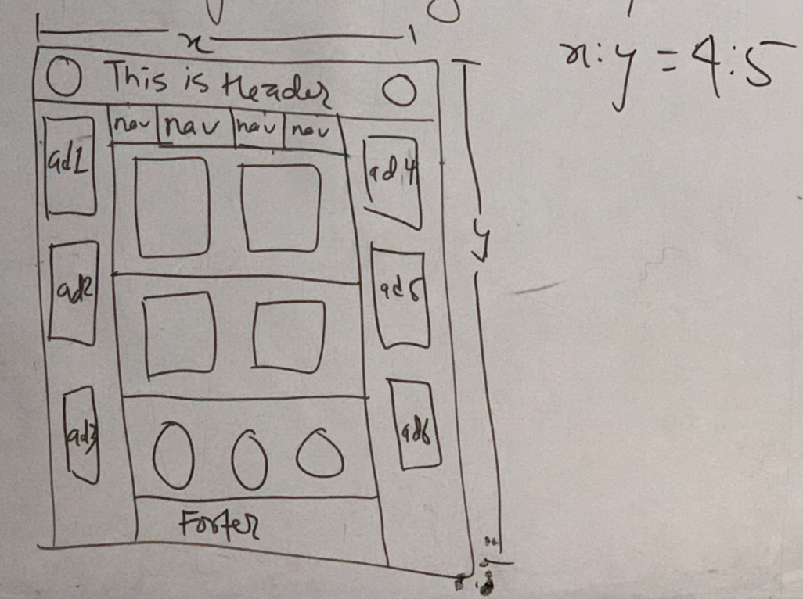

### Assignment 01

1. What is CSS Media Query? Show the use of maxwidth & minwidth properties.

2. List the properties associated with 2D effects and transformation. Show examples.

3. What is CSS-3 animation? Demonstrate it by dragging a box in any one direction.

4. Show the use of active, focus and hover effects.

5. Using CSS, draw the following objects:
    - Triangle 
    - Circle
    - Oval 
    - Triangle upon rectangle
    - Two circles joint together (X-axis)

6. Design the following template:
    

        
    

